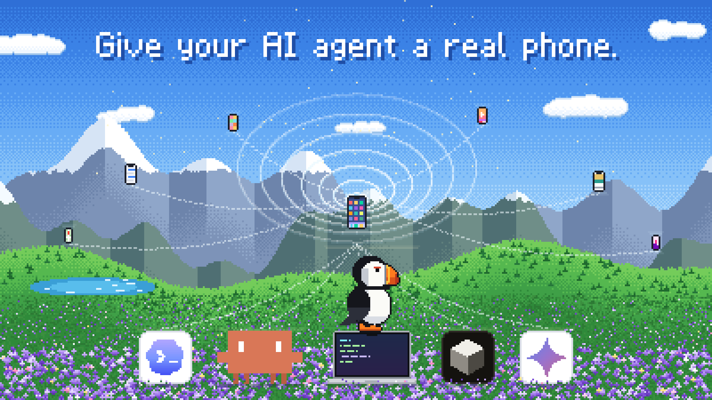

# agentthumbs



Give your AI agent a real phone.

agentthumbs lets Claude, Codex, Cursor or your own code see and operate a real phone: open apps, tap, scroll, type and post like a person does. It runs on your computer and talks to the phones you plug in. It ships as an MCP server, a CLI and a TypeScript library.

[](https://www.npmjs.com/package/@appeeky/agentthumbs) [](https://github.com/appeeky/agentthumbs/actions/workflows/ci.yml) [](LICENSE)

> **Status: 0.x.** APIs, tool names and environment variables can still change between minor versions. See the [changelog](CHANGELOG.md).

## Why

Agents can already use your terminal, your browser and your APIs. The phone is the one computer they still can't touch, and it is where your users, your competitors and your app actually live.

### Grow your app

- **Track your competitors.** Install their apps, walk the onboarding and the paywall, and report what changed since last week: new prices, a moved paywall, a new trial.
- **Check every market.** Switch the phone's language and region, and see your listing, your screenshots and your competitors' prices the way each country sees them.
- **Watch the ads in the feed.** Scroll TikTok, Instagram or YouTube and collect the sponsored posts your category is running right now.

### Ship with confidence

- **Test what you build on a real device.** A coding agent installs your build, taps through the change it just made, and tells you whether it works, on a real phone instead of a simulator.
- **Check every release.** After a version goes live, update it from the store, open it, go through onboarding and the paywall, and report what broke.
- **Reproduce bug reports.** Hand the agent a support ticket; it follows the steps on a phone and comes back with screenshots of where it fails.
- **Verify notifications and deep links.** Trigger a push, tap it, and confirm it lands on the right screen.
- **Audit accessibility.** The agent reads the same accessibility tree screen readers use, so every unlabeled button shows up.

### Give agents hands

- **From advice to action.** A growth or cofounder agent that today only writes recommendations can carry them out on the phone, and still asks a person before anything goes public.
- **Publish from your own accounts.** Post the video your team made to Instagram, TikTok or Threads from the accounts already signed in, with a person approving every post.
- **Every app becomes a tool.** Most mobile apps have no API. If a person can do it on the screen, your agent can do it too, with nothing to install on the phone.

## What works

| Phone | Driver | Needs |
| - | - | - |
| Android phone or emulator | adb | `adb` on any OS. Tested on macOS; Linux should work; Windows is untested |
| iPhones in Developer Mode | WebDriverAgent | macOS with Xcode, and `iproxy` (`brew install libimobiledevice`). Several per Mac |
| iPhone near the Mac | iPhone Mirroring | macOS 15+ and iOS 18+ on the same Apple Account. Not available in the EU |

## Install

You need Node.js 20 or newer. Nothing to install up front: `npx -y @appeeky/agentthumbs` runs the latest version. For a permanent `agentthumbs` command:

```bash
npm install -g @appeeky/agentthumbs
```

## Quick start

1. **Connect a phone.**
   - Android: turn on USB debugging (Settings → Developer options), plug it in and accept the prompt, or start an emulator. `adb devices` should list it.
   - iPhone: plug it in, unlock it and turn on Developer Mode (Settings → Privacy & Security). Then run `npx -y @appeeky/agentthumbs ios setup` and leave it running. The first run builds WebDriverAgent and takes a few minutes.
2. **Check that agentthumbs sees it:** `npx -y @appeeky/agentthumbs devices`. When nothing is listed, it says what is missing.
3. **Add the MCP server to your agent:**

   ```bash
   claude mcp add phone -- npx -y @appeeky/agentthumbs mcp
   ```

4. **Ask for something:**

   > Open Settings on my phone and turn on dark mode.

Install the [skills](#skills) too; they teach the agent how to get around a phone.

## How an agent uses it

The agent works in a loop: look, act, look again.

1. `observe` returns a screenshot with numbered boxes over everything tappable, plus a text list of those elements.
2. The agent acts on an element by number (`tap { element: 12 }`) or by pixel (`tap { x, y }`).
3. Every action returns a fresh observation once the screen stops moving, so the agent sees the result right away.

| Tool | What it does |
| - | - |
| `devices` | Connected phones, their ids and screen sizes |
| `observe` | Screenshot with numbered elements |
| `tap`, `long_press` | By element id or x/y |
| `swipe`, `scroll` | Drag between points, or scroll a direction |
| `type` | Type into the focused field. Non-ASCII text on Android needs [ADBKeyBoard](#android-notes) |
| `key` | `home`, `back`, `enter`, `delete`, `app_switch`, `volume_up`, `volume_down`, `lock`; which ones work depends on the driver |
| `open_app`, `list_apps` | Launch apps by package name or bundle id |
| `push_media` | Copy an image or video into the phone's gallery, from a path or a URL |

Coordinates are pixels in the screenshot the agent received. agentthumbs scales them to the device.

## Safety

An agent with your phone can do anything you can. agentthumbs adds guardrails that do not depend on the model behaving:

- **Approval before publishing.** Tapping an element labelled like Post, Share, Send, Buy, Pay or Delete pauses for a human. The MCP server asks through the client's elicitation prompt, or a native macOS dialog when the client has none.
- **Rate limits.** 30 actions a minute and 600 an hour per phone by default.
- **Action log.** Every action is appended to `~/.agentthumbs/logs/<date>.jsonl`.

Turn approvals off with `agentthumbs mcp --approval off` only for phones and accounts you are comfortable handing over completely.

Use agentthumbs on your own devices and accounts, and follow each app's terms. It is not built for running fleets of fake accounts.

## Skills

[Agent Skills](https://agentskills.io) in [`skills/`](skills) teach the agent how a careful person uses a phone:

| Skill | For |
| - | - |
| `agentthumbs` | The loop, getting around, posting content, and the rules for every task |
| `ios-basics` | Home, the app switcher, search, keyboards and going back on an iPhone |
| `app-store` | Installing, opening and updating apps |
| `permissions-and-dialogs` | Permission, tracking, notification and rating prompts |
| `sign-in` | Login screens, SSO, and 2FA codes that arrive on the phone |
| `app-teardown` | Walking an app's store page, onboarding and paywall, and reporting what changed |
| `release-check` | Checking your own app after a release, step by step, as pass or fail |
| `instagram`, `tiktok`, `threads` | Posting, drafts, the AI label, and switching between signed-in accounts |
| `emulator-farm` | For a coding agent on a Linux server: Android emulators in Docker with KVM, connected to adb and agentthumbs |

Install them with the [skills CLI](https://github.com/vercel-labs/skills), which works for Claude Code, Cursor, Codex and other agents:

```bash
npx skills add appeeky/agentthumbs
```

Or copy the folders you want from [`skills/`](skills) into your agent's skills directory (`~/.claude/skills/` for Claude Code).

## Remote

Run the agent in the cloud and keep the phones on your desk: `agentthumbs serve` connects this computer's phones to a relay, and `agentthumbs relay` is a small self-hostable relay that serves MCP over HTTP. See [Remote phones](docs/guides/remote.mdx), and [Device farms](docs/guides/device-farm.mdx) for many phones on your own servers.

## CLI

The CLI is handy for debugging and scripts. It keeps the last observation so element ids work across calls.

```bash
agentthumbs devices
agentthumbs observe            # prints elements, saves ~/.agentthumbs/last.jpg
agentthumbs tap 12
agentthumbs type "Hello from agentthumbs"
agentthumbs scroll down
agentthumbs key home
agentthumbs open com.android.settings
agentthumbs push ./video.mp4
agentthumbs ios setup          # build and start WebDriverAgent on every connected iPhone
```

`agentthumbs --help` lists every command. See the [CLI reference](docs/reference/cli.mdx).

## Library

```bash
npm install @appeeky/agentthumbs
```

```ts
import { createAgentThumbs } from "@appeeky/agentthumbs";

// Decide per request; here every publish-like tap is refused.
const thumbs = createAgentThumbs({ approver: async (request) => false });
const phone = await thumbs.device();
const { elements } = await phone.observe();
const settings = elements.find((e) => e.label === "Settings");
if (settings) await phone.tap({ element: settings.id });
```

See [Use it from code](docs/guides/library.mdx).

## Android notes

- Typing non-ASCII text (accented letters, emoji) uses [ADBKeyBoard](https://github.com/senzhk/ADBKeyBoard/releases). Install the latest release APK. agentthumbs switches to it only while typing and restores your keyboard after.
- Emulators work. The first `observe` after a big screen change can take a couple of seconds while the UI tree settles.

## Architecture

```
Agent (MCP / CLI / SDK)
  └─ Runtime   element ids, coordinate scaling, wait-for-stable, approvals, rate limits, log
       └─ Drivers   adb (Android) · wda (iOS) · mirroring (iOS)
```

Drivers only move pixels and events. Everything else lives in the runtime, so a new transport is one small interface. See [Writing a driver](docs/reference/writing-a-driver.mdx).

Everything ships in one package, `@appeeky/agentthumbs`:

| Import | |
| - | - |
| `@appeeky/agentthumbs` | Everything: runtime, drivers, MCP server, CLI (`agentthumbs`), relay and connector |
| `@appeeky/agentthumbs/remote` | Protocol, MCP tools and relay, without drivers or native modules, for servers |
| `@appeeky/agentthumbs/core` | Just the runtime, for writing a driver |

## Documentation

The full docs are in [`docs/`](docs), built with [Mintlify](https://mintlify.com). Start with the [quickstart](docs/quickstart.mdx), or preview the site locally with `npm run docs`.

## Development

```bash
git clone https://github.com/appeeky/agentthumbs
cd agentthumbs
npm install
npm run build
npm test
npm run e2e          # needs a connected phone or emulator
npm run docs:check   # validates the docs and their links
npm link -w packages/agentthumbs   # use your local build as the agentthumbs command
```

### Releases

Merging to `main` releases automatically. After the tests pass, CI reads the [Conventional Commits](https://www.conventionalcommits.org) since the last `v*` tag and bumps the version:

| Commits since the last release | Release |
| - | - |
| `fix:` or `perf:` | patch, `0.1.0` → `0.1.1` |
| `feat:` | minor, `0.1.0` → `0.2.0` |
| `feat!:`, `fix!:` or a `BREAKING CHANGE:` footer | major, or minor while at `0.x` |
| only `docs:`, `chore:`, `test:`, `refactor:`, … | none |

It then publishes the package to npm, adds a section to the changelog, tags `v<version>` and creates the GitHub release. `npm run release:dry` shows what the next release would be, and `npm run pack:check` what the package would ship.

See [CHANGELOG.md](CHANGELOG.md) for what changed.

## License

agentthumbs is licensed under the [Functional Source License, Version 1.1, MIT Future License](LICENSE) (FSL-1.1-MIT).
